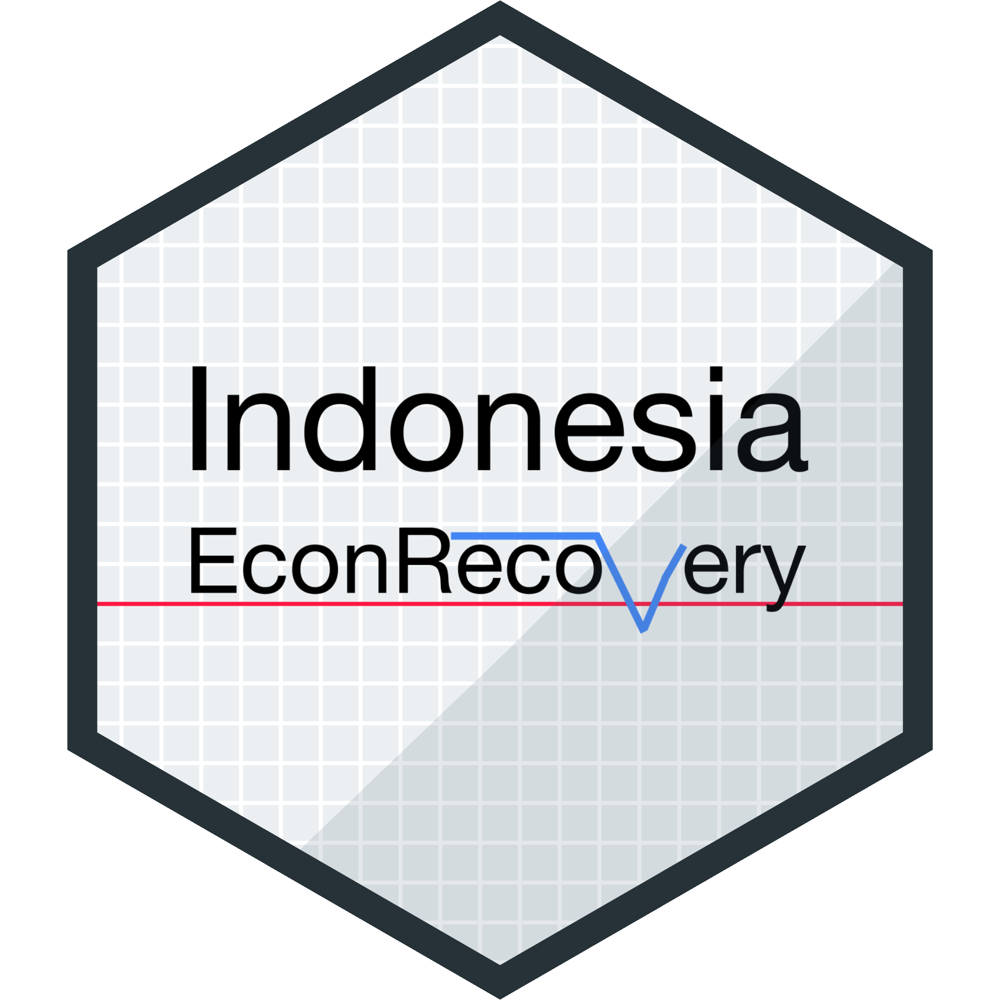

# Indonesia EconRecovery 

The Indonesia EconRecovery website publishes charts and tables on key economic indicators to track the country’s recovery from the COVID-19 pandemic. The website gets updated every day.

## Data

The website sources most datasets from Statistics Indonesia (BPS) and collects them through the agency’s [application programming interface (API)](https://webapi.bps.go.id/). In addition, the website also puts together datasets from [Bank Indonesia (BI)](https://www.bi.go.id/id/publikasi/laporan/default.aspx) and [Google](https://www.google.com/covid19/mobility/), all of which are available on their website. For the COVID-19 metrics, the website uses Our World in Data’s (OWID) coronavirus dataset, which you can find on [its repo](https://github.com/owid/covid-19-data/tree/master/public/data).

For economic growth and annual inflation rate, the website also adds projections made by organizations like the World Bank and the Organization for Economic Cooperation and Development (OECD). Where appropriate, the development targets for indicators such as the unemployment and poverty rates outlined by the government are also included.

Although the website gets updated regularly, in some cases there are delays in reporting. For example, although BPS updates the inflation data on the first day of every month, the inflation by component dataset does not get updated on the same day. The same is also true for other datasets that still come in what the agency called a static table.

As of the latest update released on April 5, 2021, the datasets included on the website are as follow:

Data | Source  
------ | ----------  
[Consumer confidence index](https://dzulfiqarfr.github.io/indonesia-recovery-tracker/cci.html) | BI  
[Employment](https://dzulfiqarfr.github.io/indonesia-recovery-tracker/employment.html) | BPS  
[Economic growth](https://dzulfiqarfr.github.io/indonesia-recovery-tracker/gdp.html) | BPS  
[Inflation](https://dzulfiqarfr.github.io/indonesia-recovery-tracker/inflation.html) | BPS  
[Mobility](https://dzulfiqarfr.github.io/indonesia-recovery-tracker/mobility.html) | Google  
[Poverty](https://dzulfiqarfr.github.io/indonesia-recovery-tracker/poverty.html) | BPS  
[Retail sales index](https://dzulfiqarfr.github.io/indonesia-recovery-tracker/rsi.html) | BI  
[COVID-19](https://dzulfiqarfr.github.io/indonesia-recovery-tracker/index.html) | OWID  

The datasets are available in a tidy format in CSVs, which you can find in the [data :folder:](/data).

## What's new

**April 4, 2021**:
- the name was changed to Indonesia EconRecovery;  
- the layout was updated and now used the [distill](https://rstudio.github.io/distill/);  
- added charts on the Consumer Confidence Index by income group and the Retail Sales Index by category;  
- add charts and tables on inflation, employment and poverty;  
- made the tables filterable and sortable by moving to [reactable](https://glin.github.io/reactable/index.html) from [gt](https://gt.rstudio.com/index.html); and  
- added links to download datasets and charts  
- improved chart tooltips