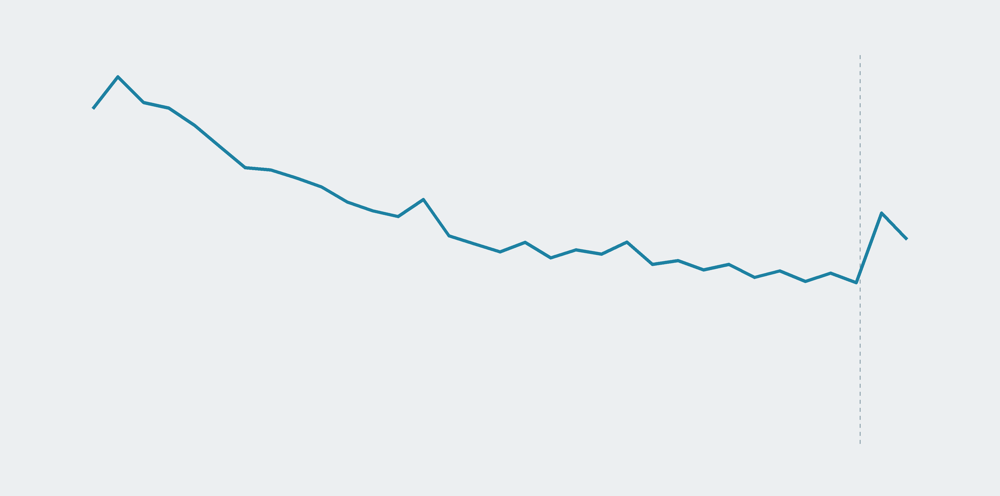
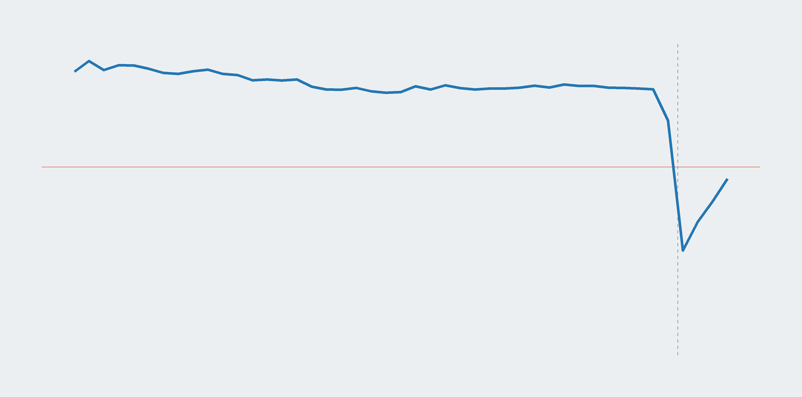

```{r setup, include=FALSE}
# chunk options
knitr::opts_chunk$set(echo = FALSE)
```

&nbsp;

<h1 style="text-align: center;">Tracking Indonesia's economic recovery from COVID-19</h1>

<hr style="width: 50%;">  

Charts and tables to explore how the pandemic has affected Indonesia's economy as the virus has battered the nation's public health since early March 2020.

<b>&rarr; Economy</b>

```{r table: key econ indicators}
source("script/key_indicator_script.R", local = knitr::knit_global())

reactable_key_econ
```

<div style="color: #999; font-size: 12px;">
Last updated on `r format(Sys.Date(), "%B %d, %Y")`  
Source: Statistics Indonesia (BPS)  
*International Monetary Fund's (IMF) April 2021 outlook  
<sup>&#8224;</sup>Government target
</div>

To fight the pandemic, the government has started a vaccination campaign and is planning to inoculate around 181.5 million people, nearly 70 percent of the total population.

<b>&rarr; COVID-19</b>

```{r table: key covid-19 indicators}
reactable_key_covid
```

<div style="color: #999; font-size: 12px;">
Last updated on `r format(Sys.Date(), "%B %d, %Y")`  
Source: Our World in Data  
</div>

<b>Latest</b>  

* The retail sales index grew by 14.7 percent year-on-year (yoy) in May and was projected to grow slower by 4.53 percent yoy in June. ([Read more](rsi.html))  

* The consumer confidence index rose further to 107.36 in June. The improvement was seen across all income groups. ([Read more](cci.html))

* Consumer prices posted a monthly deflation of 0.16 percent and annual inflation of 1.33 percent in June, slowing from the peak spending period in April and May. ([Read more](inflation.html))


## Explore

<div class="row">

<div class="column">
<div class="card">
<a href="cci.html">

<h4>Consumer confidence</h4>
</a>
</div>
</div>

<div class="column">
<div class="card">
<a href="employment.html">

<h4>Employment</h4>
</a>
</div>
</div>
  
<div class="column">
<div class="card">
<a href="gdp.html">

<h4>Economic growth</h4>
</div>
</div>
  
<div class="column">
<div class="card">
<a href="inflation.html">

<h4>Inflation</h4>
</a>
</div>
</div>

<div class="column">
<div class="card">
<a href="mobility.html">

<h4>Community mobility</h4>
</a>
</div>
</div>

<div class="column">
<div class="card">
<a href="poverty.html">

<h4>Poverty</h4>
</a>
</div>
</div>

<div class="column">
<div class="card">
<a href="rsi.html">

<h4>Retail sales</h4>
</a>
</div>
</div>

</div>

```{css}
d-title, d-byline {
  display: none
}
```