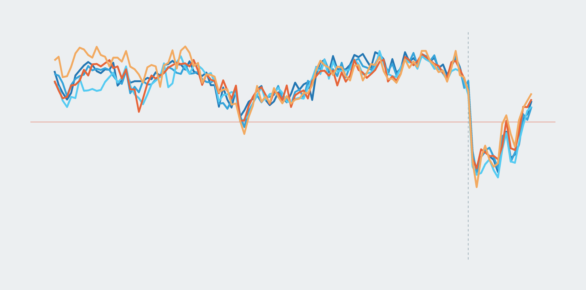
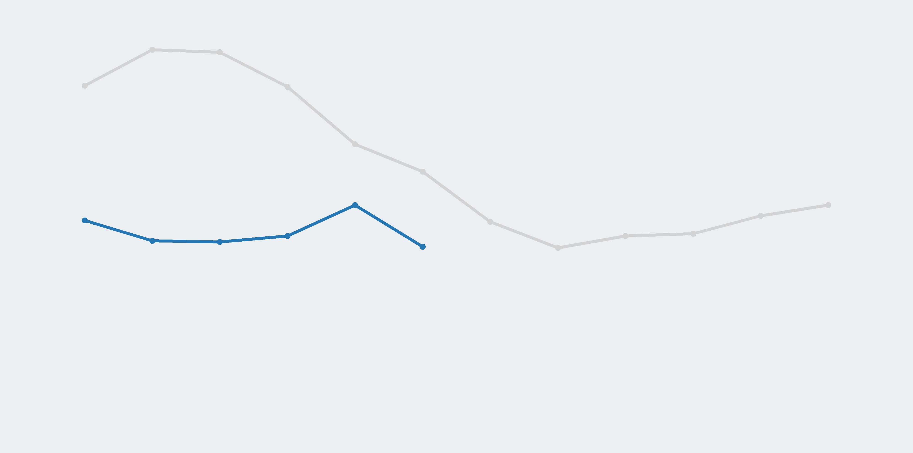
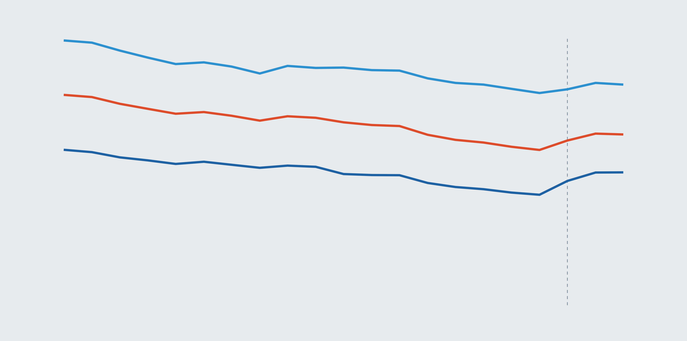

```{r setup, include=FALSE}
# chunk options
knitr::opts_chunk$set(echo = FALSE)
```

&nbsp;

<h1 style="text-align:center;">Tracking Indonesia's economic recovery from COVID-19</h1>

<hr style="width:50%;text-align:center;">

Charts and tables to explore how the pandemic has affected Indonesia's economy as the virus has battered the nation's public health since early March 2020.

<b>&rarr; Summary</b>

```{r table: key indicators, layout="l-body-outset"}
source("script/key_indicator_script.R", local = knitr::knit_global())

reactable_key_ind
```

<div style="color: #999; font-size: 12px;">
Source: Statistics Indonesia (BPS); Our World in Data  
<sup>*</sup>Organization for Economic Cooperation and Development's (OECD) March 2021 outlook  
<sup>&#8224;</sup>Government target
</div>


## Explore

<div class="row">

<div class="column">
<div class="card">
<a href="cci.html">

<h4>Consumer confidence</h4>
</a>
</div>
</div>

<div class="column">
<div class="card">
<a href="employment.html">

<h4>Employment</h4>
</a>
</div>
</div>
  
<div class="column">
<div class="card">
<a href="gdp.html">

<h4>Economic growth</h4>
</div>
</div>
  
<div class="column">
<div class="card">
<a href="inflation.html">

<h4>Inflation</h4>
</a>
</div>
</div>

<div class="column">
<div class="card">
<a href="mobility.html">

<h4>Community mobility</h4>
</a>
</div>
</div>

<div class="column">
<div class="card">
<a href="poverty.html">

<h4>Poverty</h4>
</a>
</div>
</div>

<div class="column">
<div class="card">
<a href="rsi.html">

<h4>Retail sales</h4>
</a>
</div>
</div>

</div>

```{css}
d-title, d-byline {
  display: none
}
```